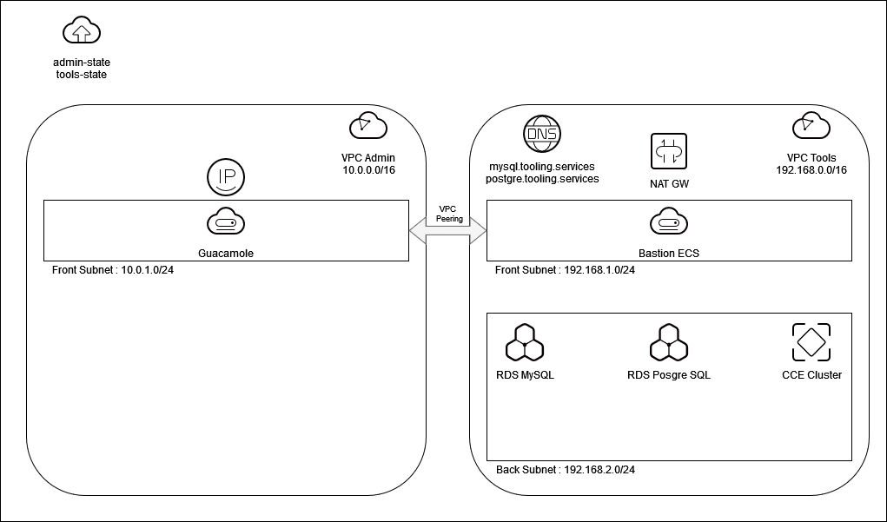
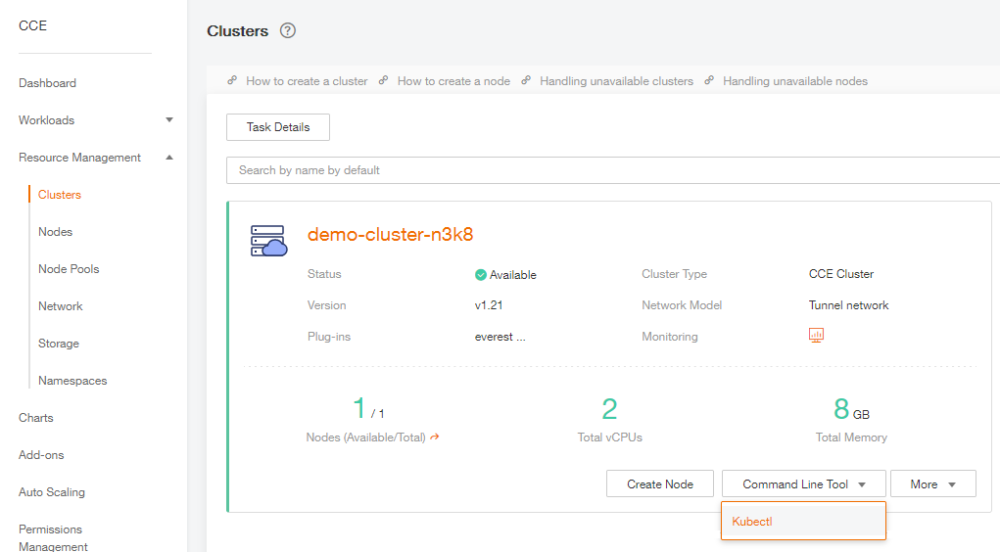
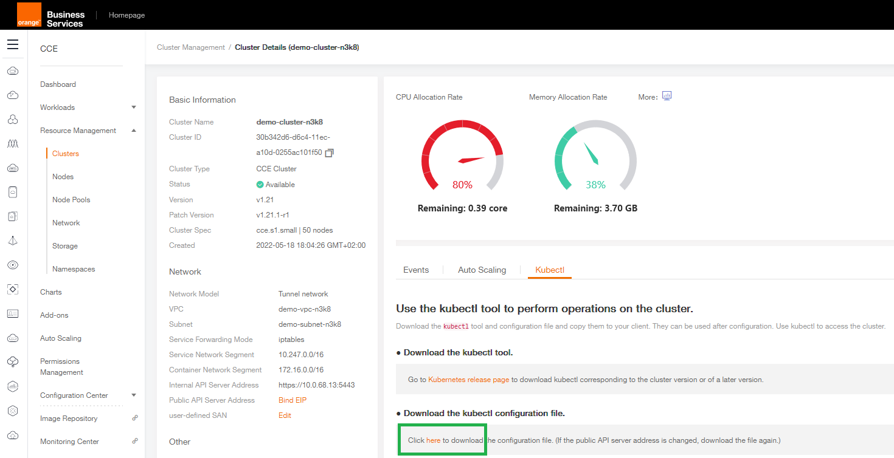

# Description

In this repository you will find an example of deployment of the following resources with Terraform and the Flexible Engine provider :

- 2 OBS Buckets to store Terraform States for each part of infrastructure (Admin and Tools)
- 1 KeyPair (stored locally in deployment folder to easily access ressources)
- Admin VPC (10.0.0.0/16)
  - Router
  - Subnet : 10.0.1.0/24
  - Guacamole server (to access infrastructure)
    - 1 EIP
  - Security Group
    - Security Inbound rule : to access ssh on xxxx port
    - allow only your IP x.x.x.x
- Tools VPC (192.168.0.0/16)
  - Router
  - Frontend Subnet : 192.168.1.0/24
    - VM Bastion server
      - We will use to access CCE Cluster with Kubectl
  - Backend Subnet : 192.168.2.0/24
  - CCE Cluster version 1.21
    - a CCE Node Pool with 1 node
    - CCE auto scaler addon
  - NAT Gateway 
    - an SNAT rule : to allow CCE nodes to access internet and pull docker images
  - RDS MySQL : to store billing data
  - RDS Postgre : to store SuperSet datas
- VPC Peering between Admin and Tools VPCs


# Schema



# Before deployment

## Configure Remote State Backend for FlexibleEngine

As FlexibleEngine OSS (Object Storage Service) can be compatible with the AWS S3 interface, and [Amazon S3](https://www.terraform.io/docs/language/settings/backends/s3.html) backend supports custom endpoints, we can use S3 backend to store state files in OSS.

Although the terraform block does not accept variables or locals and all backend configuration values must be hardcoded, you can provide the credentials via the **AWS_ACCESS_KEY_ID** and **AWS_SECRET_ACCESS_KEY** environment variables to access OSS, respectively.

### Set Environment Variables

We will customize the set-env.sh file with your variables (AK, SK, region, domain name...), those values will be used by the Flexible Engine Provider to authenticate you and deploy your infrastructure.

```bash
# Either your ACCESS_KEY and SECRET_KEY or from a serviceaccount
export OS_ACCESS_KEY="REPLACEME"
export OS_SECRET_KEY="replaceme"
export AWS_ACCESS_KEY_ID=$OS_ACCESS_KEY
export AWS_SECRET_ACCESS_KEY=$OS_SECRET_KEY
export OS_REGION_NAME="eu-west-0"
export OS_DOMAIN_NAME="OCB000xxxx"
export OS_PROJECT_NAME="eu-west-0_myproject"
export OS_AUTH_URL="https://iam.eu-west-0.prod-cloud-ocb.orange-business.com/v3"
export OS_INSECURE="true"
```

Source the set-env.sh file

```bash
source set-env.sh
```

## Customize variables 

You can also edit the variables.tf files to pass in your own values.

For example :

```yaml
variable "project" {
  default = "demo"
  description = "Short descriptive, readable label of the project you are working on. Is utilized as a part of resource names."
}

variable "remote_ip" {
  default = "90.10.10.90/32"
  description = "remote IP allowed for ssh access to Bastion"
}

variable "ssh_port" {
  default = "8888"
  description = "ssh port to access Bastion."
}

variable "vpc_cidr" {
  default = "192.168.0.0/16"
  description = "ssh port to access Bastion."
}

variable "subnet_cidr" {
  default = "192.168.0.0/16"
  description = "ssh port to access Bastion."

```

## Cloud init

You can also customize the cloud init file packages.yaml if you want to deploy more packages on your bastion host :

```yaml
#cloud-config
package_update: true
packages:
  - figlet
  - unzip
  - dnsutils
  - curl
  - git
  - telnet
  - vim

runcmd:
  - sed -i -e '/^Port/s/^.*$/Port 8888/' etc/ssh/sshd_config
  - service ssh restart
  - curl -LO "https://dl.k8s.io/release/$(curl -L -s https://dl.k8s.io/release/stable.txt)/bin/linux/amd64/kubectl"
  - curl -LO "https://dl.k8s.io/$(curl -L -s https://dl.k8s.io/release/stable.txt)/bin/linux/amd64/kubectl.sha256"
  - install -o root -g root -m 0755 kubectl /usr/local/bin/kubectl
  - mkdir -p $HOME/.kube
```

Here we will modify default SSH port to 8888 and pre install Kubectl to access our CCE cluster.

# Deploying

## Bucket

First we need to create two buckets to store Admin and Tools remote state

```bash
cd /remote_state
terraform plan
terraform apply
```

## Admin

Then we will deploy the admin environment

```bash
cd /admin
terraform plan
terraform apply
```

## Tools

We can now deploy the tools environment which also use some variables (like random unique ID) from admin remote state

```
cd /tools_state
terraform plan
terraform apply
```

Now wait 5 to 10 minutes for your infrastructure to be ready, proving RDS and CCE can take some times.

## Peering

Finally we can now build a VPC peering between both environment

```
cd /peering
terraform plan
terraform apply
```

# Accessing your infrastructure

Once it is finished, the ouput will return : 

- the KeyPair name (xxxx)

- SSH Port (yyyy)

- the Public IP of your bastion (z.z.z.z)

  

## SSH Bastion

You can access your bastion with SSH :

```
ssh -i demo-KeyPair-xxxx -p yyyy z.z.z.z
```

## Configure Kubectl

Go to Flexible Engine console, on the CCE clusters that we just deployed, go to Command Line Tool as following :



On the next page download the Kubectl configuration file (Kubeconfig.json)                                       



Open the file with a notepad, copy the content and paste it in a new file on your bastion (or upload it directly to the bastion with sftp for example)

Once it is done, rename the kubeconfig.json file to config in the .kube folder

```bash
mv -f kubeconfig.json $HOME/.kube/config
```

You can now verify that you can access your CCE cluster

```bash
cloud@bastion-n3k8:~$ kubectl get nodes
NAME          STATUS   ROLES    AGE     VERSION
10.0.41.168   Ready    <none>   4d16h   v1.21.7-r0-CCE21.12.1.B004
```


